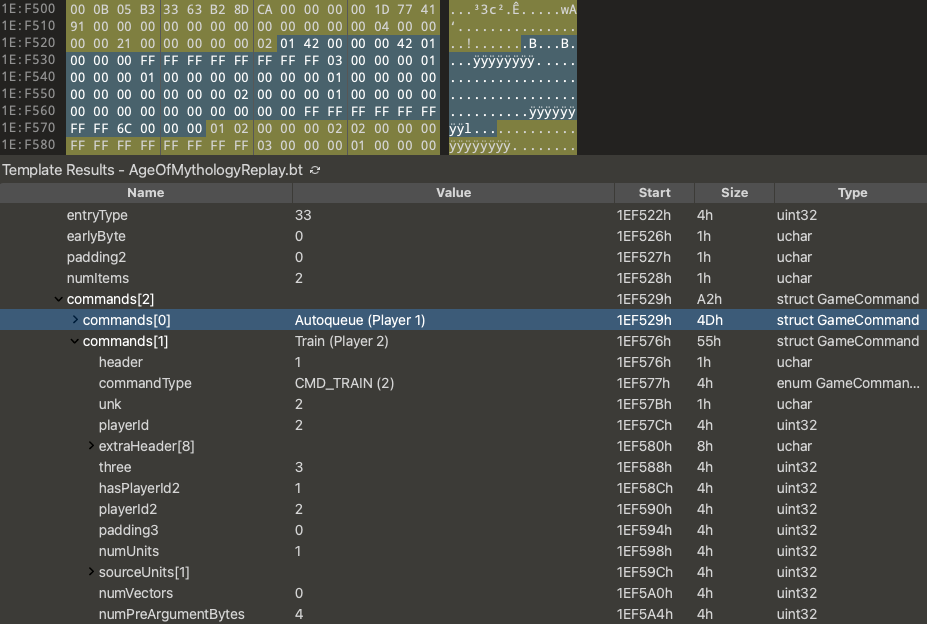

## Replay Tool for Age of Mythology: Retold

This project is a toolkit for exploring and manipulating replay files in Age of Mythology: Retold. Due to the proprietary binary format and extensive use of hardcoded values, the replay structure is inherently fragile and tightly coupled to each game version. As such, **only the latest game version will be supported**. If something is not working for you, please raise an issue.

The best way to understand the replay format is to read the [010 Editor](https://www.sweetscape.com/010editor/) binary [template](AgeOfMythologyReplay.bt) provided in this project. Note that the "nodes" section of each replay is zlib compressed and identified by a "l33t" header. If you want to explore this section in the binary template, you have to decompress it in-place first. The Go tool in this project can do this for you. Otherwise, the template will still work, but nodes will be presented as raw bytes.

The binary template allows you to visually explore replay files and easily identify new fields or changes across game updates. Due to the template's clear and concise syntax, It can also be used as a source of truth when writing parsers or tools.

### Features

- Unpack a replay from its "l33t" compressed data, so it can be explored and hex edited in-place
- Repack a previously unpacked replay into a fully functional replay that can be read by the game
- 010 Editor template to parse a replay file, including:
  - Nodes (if unpacked first)
    - XMBs
    - Profile keys
    - Build info
    - Heuristics for unknown node traversal
  - Game commands
  - Source map

### Resources

- https://github.com/erin-fitzpatric/next-aom-gg
- https://github.com/jerkeeler/restoration
- https://github.com/Logg-y/retoldrecprocessor

### Future plans

Anonymize replay from profile keys:

- gameplayfabpartyaddress
- gameplayer1rlinkid
- gameplayer1name
- gameplayer1pfentity
